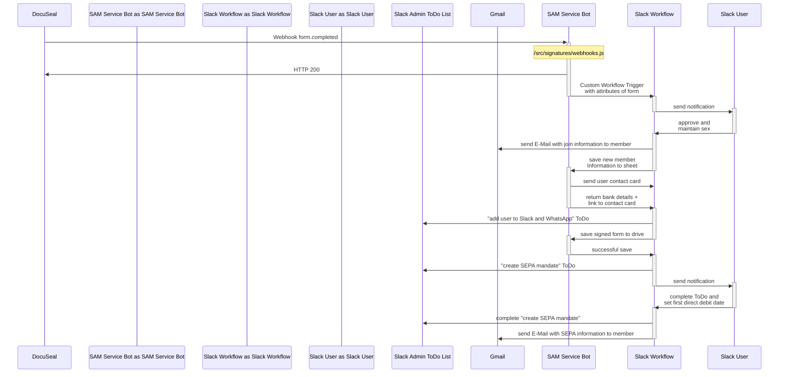

# Funktionen

Under construction 👷🚧🏗️

```mermaid
sequenceDiagram
  participant DocuSeal as DocuSeal
  participant SAM Service Bot as SAM Service Bot
  participant Slack Workflow as Slack Workflow
  participant Slack User as Slack User
  participant Slack Admin ToDo List
  participant Gmail as Gmail
  DocuSeal ->>+ SAM Service Bot: Webhook form.completed
  Note over SAM Service Bot: /src/signatures/webhooks.js
  SAM Service Bot ->> DocuSeal: HTTP 200
  SAM Service Bot ->>- Slack Workflow: Custom Workflow Trigger<br>with attributes of form
  activate Slack Workflow
  Slack Workflow ->>+ Slack User: send notification
  deactivate Slack Workflow
  Slack User ->>- Slack Workflow: approve and<br/>maintain sex
  activate Slack Workflow
  Slack Workflow ->> Gmail: send E-Mail with join information to member
  Slack Workflow ->>+ SAM Service Bot: save new member<br/>Information to sheet
  deactivate Slack Workflow
  SAM Service Bot ->> Slack Workflow: send user contact card
  SAM Service Bot ->>- Slack Workflow: return bank details +<br>link to contact card
  activate Slack Workflow
  Slack Workflow ->> Slack Admin ToDo List: "add user to Slack and WhatsApp" ToDo
  Slack Workflow ->>+ SAM Service Bot: save signed form to drive
  deactivate Slack Workflow
  SAM Service Bot ->>- Slack Workflow: successful save
  activate Slack Workflow
  Slack Workflow ->> Slack Admin ToDo List: "create SEPA mandate" ToDo
  Slack Workflow ->>+ Slack User: send notification
  deactivate Slack Workflow
  Slack User ->>- Slack Workflow: complete ToDo and<br>set first direct debit date
  activate Slack Workflow
  Slack Workflow ->> Slack Admin ToDo List: complete "create SEPA mandate"
  Slack Workflow ->> Gmail: send E-Mail with SEPA information to member
  deactivate Slack Workflow
```
